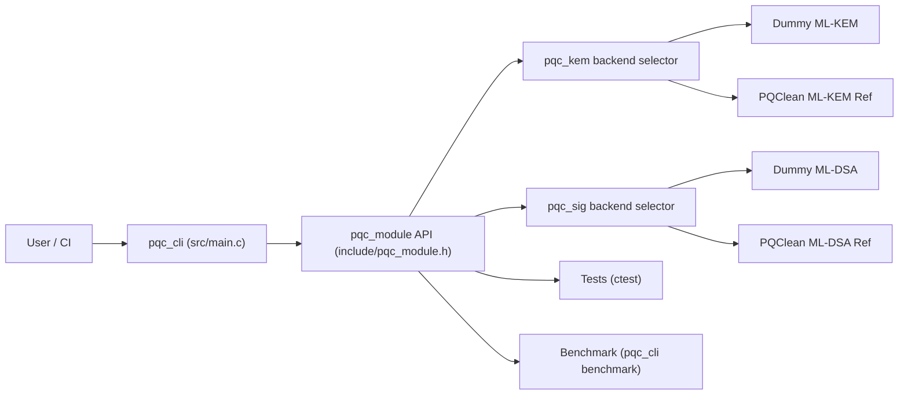

# PQC Crypto Module Lab

[](https://github.com/treasonking/PQC_Project/actions/workflows/ci.yml)
[](https://github.com/treasonking/PQC_Project/actions/workflows/quality.yml)
[](https://github.com/treasonking/PQC_Project/actions/workflows/codeql.yml)

C 기반 PQC 모듈 개인 프로젝트입니다.  
목표는 **KEM + Signature를 공통 API/CLI/테스트/벤치마크/문서화까지 연결**해서 실제 개발 역량을 보여주는 것입니다.

## Interviewer Quick View

| Focus | Summary |
| --- | --- |
| Why this architecture | `pqc_module`(공통 인터페이스)와 `pqc_kem`/`pqc_sig`(알고리즘 계층)를 분리해, CLI/테스트 코드를 유지한 채 백엔드(Dummy ↔ PQClean Ref)를 교체할 수 있도록 설계했습니다. |
| Direct project value | 공통 API, 상태 코드 기반 오류 흐름, CLI/테스트/벤치마크/CI 연결, KAT/변조/실패 경로 검증을 직접 설계하고 통합했습니다. |
| Security boundary | 학습/참조 구현 통합이 목적이며, side-channel 대응, production hardening, thread-safety, 인증(FIPS/KCMVP), 운영 키관리(HSM/감사추적)는 현재 범위 밖입니다. |
| Test evidence | 정상 경로(라운드트립/KAT) + 실패 경로(변조 입력, 길이 오류, 빈 메시지, 누락/손상 파일)를 CI에서 자동 검증합니다. |

## Architecture Diagram



## Benchmark Snapshot (Sample)

Latest sample (`mlkem-ref` + `mldsa-ref`, `iterations=1000`):

| KEM keygen (ms) | KEM encaps (ms) | KEM decaps (ms) | SIG keygen (ms) | SIG sign (ms) | SIG verify (ms) |
| --- | --- | --- | --- | --- | --- |
| 0.402 | 0.420 | 0.102 | 0.547 | 1.326 | 0.230 |

참고: 환경/컴파일 옵션에 따라 값은 달라질 수 있으며, 원본 결과는 `bench_result.csv`와 `docs/benchmark.md`를 기준으로 갱신합니다.

## Architecture Summary

이 프로젝트는 **공통 API 계층(`pqc_module`)과 알고리즘 종속 계층(`pqc_kem`, `pqc_sig`)을 분리**한 구조입니다.  
이렇게 분리하면 CLI/테스트 코드를 유지한 채 백엔드(더미 ↔ PQClean 참조 구현)를 교체할 수 있어, 구현 변경 대비 검증/문서/운영 흐름을 안정적으로 유지할 수 있습니다.

## Security Scope Boundary

이 저장소는 **학습/참조 구현 통합 중심**입니다.  
즉, side-channel 완화, production hardening, thread-safety, 인증 대응(FIPS/KCMVP), 운영 키관리(HSM/감사추적)는 현재 범위에 포함하지 않습니다.

더미 백엔드는 API/CLI/테스트 흐름 검증용이며, `rand()` 기반 테스트 RNG를 사용하므로 암호학적 용도로 사용하면 안 됩니다.

## Validation Snapshot

| What | Current Coverage |
| --- | --- |
| KEM correctness | roundtrip/repeat/tamper (`test_kem`, `test_ref_kem`) |
| Signature correctness | roundtrip/tamper/length/empty message (`test_sig`) |
| KAT-style check | stored ML-DSA vector verify + stored secret-key sign/verify (`test_kat_mldsa`) |
| Failure-case handling | tampered ciphertext/signature, invalid lengths, empty message, missing/corrupted input files |
| CI/Quality | Linux+Windows CI, `cppcheck` quality workflow |

## Current Scope

### KEM
- API: `pqc_kem_keypair`, `pqc_kem_encaps`, `pqc_kem_decaps`
- CLI: `keygen`, `encaps`, `decaps`
- 알고리즘 선택: `--alg <dummy|mlkem-ref>`

### Signature
- API: `pqc_sig_keypair`, `pqc_sig_sign`, `pqc_sig_verify`
- CLI: `sig-keygen`, `sign`, `verify`
- 알고리즘 선택: `--sig-alg <dummy-dsa|mldsa-ref>`

### Benchmark
- **공식 벤치 엔트리포인트는 `pqc_cli benchmark` 하나로 통일**되어 있습니다.
- `bench/parse_results.py`는 벤치 결과(TXT/CSV) 요약 파서입니다.

## Implementation Status

| Area | Dummy | PQClean Ref | Notes |
| --- | --- | --- | --- |
| ML-KEM-768 | Yes | Yes (`mlkem-ref`) | KEM keygen/encaps/decaps 구현 |
| ML-DSA-65 | Yes | Yes (`mldsa-ref`) | Signature keygen/sign/verify 구현 |
| CLI | Yes | Yes | KEM/Signature/Benchmark 통합 |
| Tests | Yes | Yes | 단위/음성/KAT 포함 |
| CI | Yes | Yes | Linux + Windows(MSYS2 MinGW) |

## Build Matrix (CMake Conditional)

| Condition | KEM Backend | Signature Backend |
| --- | --- | --- |
| `third_party/mlkem_pqclean` + `common` 존재, `third_party/mldsa_pqclean` 존재 | Dummy + ML-KEM Ref | Dummy + ML-DSA Ref |
| ML-KEM 경로 미존재 | Dummy only | (ML-DSA 조건에 따름) |
| ML-DSA 경로 미존재 | (ML-KEM 조건에 따름) | Dummy only |

참고:
- KEM Ref 활성 플래그: `PQC_ENABLE_MLKEM_REF`
- Signature Ref 활성 플래그: `PQC_ENABLE_MLDSA_REF`

## Directory

```text
pqc-crypto-module-lab/
  ├─ CMakeLists.txt
  ├─ README.md
  ├─ docs/
  │   ├─ architecture.md
  │   ├─ benchmark.md
  │   ├─ security.md
  │   ├─ cli.md
  │   ├─ troubleshooting.md
  │   └─ portfolio-summary.md
  ├─ include/
  │   └─ pqc_module.h
  ├─ src/
  │   ├─ main.c
  │   ├─ pqc_module.c
  │   ├─ pqc_kem.c
  │   ├─ pqc_sig.c
  │   ├─ pqc_kem_backend.h
  │   ├─ pqc_sig_backend.h
  │   └─ pqc_utils.c
  ├─ tests/
  │   ├─ test_kem.c
  │   ├─ test_ref_kem.c
  │   ├─ test_sig.c
  │   ├─ test_negative.c
  │   ├─ test_kat_mldsa.c
  │   └─ data/
  │       ├─ bad.ct
  │       ├─ bad.sec
  │       ├─ kat_mldsa_msg.txt
  │       ├─ kat_mldsa_pub.key
  │       ├─ kat_mldsa_sec.key
  │       └─ kat_mldsa.sig
  ├─ bench/
  │   └─ parse_results.py
  ├─ third_party/
  │   ├─ mlkem_pqclean/
  │   ├─ mldsa_pqclean/
  │   └─ README.md
  ├─ scripts/
  │   ├─ build_linux.sh
  │   ├─ build_windows.bat
  │   ├─ run_all.sh
  │   └─ run_all_windows.bat
  └─ .github/workflows/
      ├─ ci.yml
      ├─ quality.yml
      └─ codeql.yml
```

## Build

```bash
cmake -S . -B build
cmake --build build
```

Warning policy:
- GCC/Clang builds enable `-Wall -Wextra -Wpedantic`.
- MSVC builds enable `/W4`.
- Third-party reference code is kept vendored and documented separately; project code should stay warning-clean under the enabled policy.

Windows 예시:

```powershell
set CMAKE_EXE=C:\path\to\cmake.exe
set CC=C:\path\to\gcc.exe
set TOOLCHAIN_BIN=C:\path\to\w64devkit\bin
scripts\build_windows.bat
```

## Run

```bash
./build/pqc_cli info --alg mlkem-ref --sig-alg mldsa-ref
./build/pqc_cli keygen --alg mlkem-ref --pub kem_pub.key --sec kem_sec.key
./build/pqc_cli sig-keygen --sig-alg mldsa-ref --pub sig_pub.key --sec sig_sec.key
./build/pqc_cli sign --sig-alg mldsa-ref --sec sig_sec.key --msg message.txt --sig message.sig
./build/pqc_cli verify --sig-alg mldsa-ref --pub sig_pub.key --msg message.txt --sig message.sig
./build/pqc_cli benchmark --alg mlkem-ref --sig-alg mldsa-ref --iterations 1000 --out bench_result.csv
```

## Tests

```bash
ctest --test-dir build --output-on-failure
```

테스트 범위 요약:
- KEM roundtrip/repeat/tamper
- Signature roundtrip/tamper/empty message/length error
- CLI 파일 오류 케이스
- ML-DSA KAT(저장된 벡터 verify + 저장된 secret key sign/verify)

## Test Evidence (Current)

| Test | Purpose |
| --- | --- |
| `test_kem` | KEM 정상/반복/변조 ciphertext 실패 |
| `test_ref_kem` | ML-KEM 참조 백엔드 roundtrip |
| `test_sig` | 서명 정상/변조/길이 오류/빈 메시지 |
| `test_kat_mldsa` | 저장된 ML-DSA 벡터 verify, 저장된 secret key sign/verify, 변조 signature/public key 실패 |
| `test_negative` | 알고리즘/입력 오류 처리 |
| `cli_missing_input_file` | CLI 입력 파일 누락 실패 |
| `cli_corrupted_key_file` | CLI 손상 키 파일 실패 |
| `quality.yml` | `cppcheck` 기반 정적 점검 자동화 |

## Verification Notes

- 프로젝트는 PQClean 참조 구현을 통합해 동작합니다.
- KAT 성격의 검증은 현재 **저장된 ML-DSA 공개키/비밀키/메시지/서명 벡터**를 사용합니다.
- 자동화 범위: 저장된 서명 verify, 저장된 secret key 기반 sign→verify, 변조 signature/public key 실패 확인.
- 아직 NIST/PQClean 공식 벡터 전체를 자동 반복하는 상태는 아닙니다.
- 향후 개선: NIST/PQClean 공식 벡터 기반 자동 KAT 확장.

## Security Notes (Honest)

- 민감 데이터(비밀키/공유비밀/서명 내부값) 원문을 로그에 출력하지 않습니다.
- 민감 버퍼는 `secure_memzero`로 정리합니다.
- 더미 알고리즘은 `rand()` 기반 테스트 RNG를 사용하므로 production 사용 금지입니다.
- 활성 알고리즘 선택은 프로세스 전역 상태를 사용하므로 thread-safe API가 아닙니다.
- constant-time/side-channel 완전 대응은 현재 범위 밖입니다.
- 이 저장소는 학습/포트폴리오 목적이며 상용 배포 수준의 보증을 제공하지 않습니다.

## CI

GitHub Actions (`.github/workflows/ci.yml`):
- Ubuntu: configure/build/test + smoke benchmark
- Windows(MSYS2 MinGW): configure/build/test + smoke benchmark
- 두 환경 모두 benchmark CSV 파싱 후 `bench_summary.txt` 생성
- benchmark 산출물(`bench_result.csv`, `bench_summary.txt`) 아티팩트 업로드

정적 점검 (`.github/workflows/quality.yml`):
- `cppcheck` 실행 (warning/style/performance/portability)

보안 점검 (`.github/workflows/codeql.yml`):
- CodeQL C/C++ 분석 (push/PR + 주간 스케줄)

## Portfolio Metadata (Recommended)

GitHub `About`에 아래 값을 권장합니다.

- Description:
  - `C-based PQC crypto module lab integrating ML-KEM-768 and ML-DSA-65 with unified API, CLI, tests, benchmarks, and CI.`
- Topics:
  - `pqc`, `ml-kem`, `ml-dsa`, `cryptography`, `c`, `cmake`, `pqclean`
